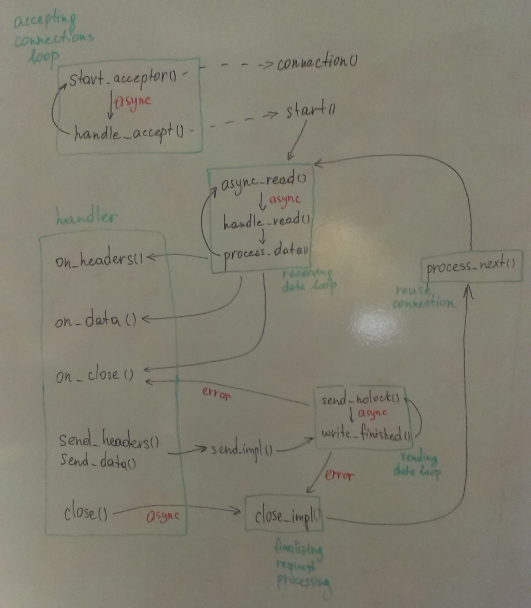

.. _request:

Request Processing
==================

.. contents:: Contents
    :local:

Writing Request Handlers
------------------------

TheVoid's server doesn't know how to handle incoming HTTP requests by default.
To inform it user must register handlers with some options about what handler
should process particular request (specific HTTP method, URI pattern, headers, etc.).

TheVoid provides user with :cpp:class:`thevoid::base_request_stream` class --
an interface for implementing custom HTTP request handlers.

.. note::
 It's recommended to use :cpp:class:`std::enable_shared_from_this` for making possible to
 prolong handler's lifetime.

Usually user doesn't need to derive from this class directly
as :cpp:class:`thevoid::request_stream\<Server\>` will suit their needs most of the time.

For convenience TheVoid provides user with several high-level interfaces for processing
incoming HTTP requests:

- :cpp:class:`thevoid::simple_request_stream\<Server\>`

  This class provides the simplest interface for implementing custom HTTP handlers.

  This class has single virtual method :cpp:func:`thevoid::simple_request_stream\<Server\>::on_request`
  that is called with complete request.

- :cpp:class:`thevoid::buffered_request_stream\<Server\>`

  This class provides an interface for chunked request processing.

  In some cases it's needed to load a lot of data from the client,
  the common case is uploading of huge video file.
  In this case it's usually not possible to fit into the memory
  so this handler allows to use the following scheme:
  read chunk, write it to the server, read next chunk and so on.

  Each chunk is passed to :cpp:func:`thevoid::buffered_request_stream\<Server\>::on_chunk`
  method. Next chunk is started to accumulate as soon as this method returns.

  After chunk's processing is finished :cpp:func:`thevoid::buffered_request_stream\<Server\>::try_next_chunk`
  should be called.

Connection/Handler Control Flow
-------------------------------

The picture above represents control flow between connection and handler.

Request from client goes through the following stages:

1. **Establishing connection between the client and server.**

 Currently TheVoid supports TCP and Unix socket connections.

 :cpp:class:`thevoid::acceptors_list\<Connection\>` is in charge of accepting
 new connections from client.
 Each acceptor from :cpp:class:`thevoid::acceptors_list\<Connection\>` creates instance of
 :cpp:class:`thevoid::connection\<SocketType\>` before new connection from client is accepted.
 After that acceptor waits for new connection from client and delegates
 request handling to the created :cpp:class:`thevoid::connection\<SocketType\>` instance.

 This stage is represented as *"accepting connection loop"* block on the picture.

 Here :cpp:func:`thevoid::acceptors_list\<Connection\>::start_acceptor` creates
 :cpp:class:`thevoid::connection\<SocketType\>` instance and asynchronously accepts
 new connection from client with :cpp:func:`thevoid::acceptors_list\<Connection\>::handle_accept`
 method that starts connection with :cpp:func:`thevoid::connection\<SocketType\>::start` method
 call.

 Existing connection can be reused according to HTTP Keep-Alive.

 Reusing connection is represented as *"reuse connection"* block on the picture.

 Here :cpp:func:`thevoid::connection\<SocketType\>::process_next` method is called after
 previous request processing is finished.

 .. note::
  How does TheVoid handle ``Connection: Keep-Alive`` header exactly?

2. **Asynchronous receiving request headers from the client.**

 Connection instance starts handling request from client by initiating asynchronous
 receiving request data.

 Once Request-Line along with Headers are received
 (`RFC 2616, Section 5. Request <http://www.w3.org/Protocols/rfc2616/rfc2616-sec5.html>`_)
 TheVoid server is able to determine which request handler
 should process this request.

 This stage is represented as *"receiving data loop"* block on the picture.

 Here :cpp:func:`thevoid::connection\<SocketType\>::async_read` method starts asynchronously
 receiving data from the client with :cpp:func:`thevoid::connection\<SocketType\>::handle_read`
 callback that calls :cpp:func:`thevoid::connection\<SocketType\>::process_data` method.
 The latter may call :cpp:func:`thevoid::connection\<SocketType\>::async_read` method again
 if received data is insufficient to parse all headers.

3. **Creating request handler.**

 Request handler is created by instance of :cpp:class:`thevoid::connection\<SocketType\>` that
 handles current request.

 User is able to register specific handlers that should process requests
 based on some criteria.

 .. note::
  What options are provided to the user by now?

 .. note::
  What criteria to select necessary request handler
  would we like to provide to the user?

4. **Passing received headers to the handler.**

 Once request handler is created received request headers are passed to the handler
 with :cpp:func:`thevoid::base_request_stream::on_headers` method call from within the current thread.

 This stage is represented as an arrow from *"receiving data loop"* block to `on_headers()` method
 within *"handler"* block on the picture.

5. **Asynchronous receiving request body from the client.**

 Once :cpp:func:`thevoid::base_request_stream::on_headers` method call returns
 TheVoid continues receiving request data according to ``Content-Length`` header value.

 This process is represented by *"receiving data loop"* block on the picture.
 
 Here :cpp:func:`thevoid::connection\<SocketType\>::process_data` method calls
 :cpp:func:`thevoid::connection\<SocketType\>::async_read` to receive more data
 from the client.

6. **Passing each received data chunk to the handler.**

 On each received data chunk request handler's :cpp:func:`thevoid::base_request_stream::on_data`
 method is called with accumulated data.
 This method must return the number of bytes actually processed by the handler from
 the passed data.
 If the passed data is fully processed (returned size is equal to the passed one)
 TheVoid continues receiving remaining request data.
 Otherwise receiving request data is stopped until the request handler asks to continue.

 This stage is represented by an arrow from *"receiving data loop"* block to `on_data()` method
 within *"handler"* block on the picture.

 If receiving data loop is stopped handler is able to resume it with
 :cpp:func:`thevoid::reply_stream::want_more` method call.

7. **Informing the handler about the end of request body.**

 Once all request data is received and passed to the handler TheVoid informs the handler
 about the end of the request by :cpp:func:`thevoid::base_request_stream::on_close` method call
 with error, if any.

 This stage is represented by an arrow from *"receiving data loop"* block to `on_close()` method
 within *"handler"* block on the picture.

 .. note::
  By now :cpp:func:`thevoid::base_request_stream::on_close` method is also called if error happens
  during sending response data.

  This is represented by an arrow from *"sending data loop"* block to `on_close()` method
  within *"handler"* block in the picture.

8. **Waiting until the handler closes the connection.**

 Despite all request data is received and passed to the handler
 request processing may still be in action on the handler's side.
 Thus, we need to wait until the handler completes its processing.

 :cpp:class:`thevoid::connection\<SocketType\>` instance prolongs its lifetime within the handler object
 and will not be destoyed until the handler asks to do so.

9. **Destroying the handler.**

 Once the handler finishes its processing and calls :cpp:func:`thevoid::reply_stream::close` method
 of the stored within the handler :cpp:class:`thevoid::connection\<SocketType\>` instance
 request processing is considered completed.
 And by this moment the handler can be safely destroyed.

 This stage is represented by *"finalizing request processing"* block on the picture.

 Here :cpp:func:`thevoid::reply_stream::close` method asynchronously invokes
 :cpp:func:`thevoid::connection\<SocketType\>::close_impl` method that removes handler's
 instance from the connection instance and may call
 :cpp:func:`thevoid::connection\<SocketType\>::process_next` method if the existing connection
 may be reused.

 .. note::
  Handler and connection objects are paired via stored smart pointers to each other.
  These smart pointers prolong lifetime of each handler and connection.

  By the end of request processing these objects must be unpaired and destroyed
  properly.

  On TheVoid's side connection can reset its stored smart pointer to the handler,
  but this doesn't mean that handler is destroyed.
  It still can exist on the user's side.

  Similarly smart pointer to the connection within the handler prolongs lifetime of
  the former.

Request Stream APIs
-----------------------

base_request_stream
++++++++++++++++++++++++

.. cpp:class:: thevoid::base_request_stream

    This class provides user with basic interface that custom request handler should support.

    .. cpp:type:: result_function

     Type of callback function.

     .. code-block:: cpp

      typedef reply_stream::result_function result_function;

    .. cpp:function:: base_request_stream()

     Construct the class object.

    .. cpp:function:: ~base_request_stream()

     Destroys the class object.

    .. cpp:function:: void on_headers(http_request &&req)

     This method is called with incoming request right after receiving of the headers from the client.

     User may store passed request anywhere within custom handler class.

    .. cpp:function:: size_t on_data(const boost::asio::const_buffer &buffer)

     This method is called at any chunk of data received from the client.

     Returns the number of processed bytes from the buffer.
     If returned number is not equal to the buffer's size server will stop receiving new data from the client
     until :cpp:func:`thevoid::reply_stream::want_more` method of the underlying reply stream is called.

    .. cpp:function:: void on_close(const boost::system::error_code &err)

     This method is called as all data from the client is received.

     If the passed error is set -- error happend during receiving data from the client.
     In such case it's recommended to stop processing of the data and call
     :cpp:func:`thevoid::reply_stream::close` method of the underlying reply stream.

     .. note::
      This method may also be called on error that happens during sending response to the client.
      Thus, this method's call with an error may be seen as a signal to the handler to stop
      request processing due to broken connection with the client.

   
    .. cpp:function:: void initialize(const std::shared_ptr<reply_stream> &reply)

     Initializes the class object with the underlying reply stream.

    .. cpp:function:: const swarm::logger &logger()

     Returns logger of the class object.

     May throw an exception if logger is not initialized.

    .. cpp:function:: const std::shared_ptr<reply_stream> &reply()

     Returns pointer to the underlying reply stream associated with the class object.

     May throw an exception if the underlying reply stream is not initialized.

request_stream
++++++++++++++++++

.. cpp:class:: thevoid::request_stream<Server>

    This class may be seen as a base for custom HTTP request handler.
    The class enhances :cpp:class:`thevoid::base_request_stream` API by providing bunch of
    :code:`send_reply` methods -- wrappers around :cpp:func:`thevoid::reply_stream::send_headers`,
    :cpp:func:`thevoid::reply_stream::send_data` and :cpp:func:`thevoid::reply_stream::close` methods.

    .. cpp:function:: void set_server(Server *server)

     Stores pointer to the server that will dispatch incoming requests to the class object.

    .. cpp:function:: Server *server()

     Returns pointer to the stored server.

     May throw an exception if pointer to the server is not initialized.

    .. cpp:function:: void send_reply(http_response &&rep)

     Sends response to the client and closes the underlying reply stream.

     .. note::
      This method doesn't provide an ability to pass custom callback.

    .. cpp:function:: void send_reply(http_response &&rep, T &&data)

     Sends response with content to the client and closes the underlying stream.

     .. note::
      This method doesn't provide an ability to pass custom callback.

    .. cpp:function:: void send_reply(int code)

     Sends response with specified status code to the client and closes the underlying reply stream.

     .. note::
      This method doesn't provide an ability to pass custom callback.

    .. cpp:function:: void send_headers(http_response &&rep, result_function &&handler)

     Sends response to the client and asynchronously calls passed handler with the result.

    .. cpp:function:: void send_headers(http_response &&rep, T &&data, result_function &&handler)

     Sends response with content to the client and asynchronously calls passed handler with the result.

    .. cpp:function:: void send_data(const boost::asio::const_buffer &data, result_function &&handler)

     Sends raw data to the client and asynchronously calls passed handler with the result.

     User must guarantee that data will be accessible until the handler's call.

    .. cpp:function:: void send_data(T &&data, result_function &&handler)

     Sends custom data to the client and asynchronously calls passed handler with the result.

    .. cpp:function:: void close(const boost::system::error_code &err)

     Closes the underlying reply stream with the error.

simple_request_stream
+++++++++++++++++++++

.. cpp:class:: thevoid::simple_request_stream<Server>

    This class provides simplified interface for implementing custom HTTP request handlers.

    .. cpp:function:: void on_request(const http_request &req, const boost::asio::const_buffer &buffer)

     This method is called as all data from the client is received without an error.

buffered_request_stream
+++++++++++++++++++++++

.. cpp:class:: thevoid::buffered_request_stream<Server>

    This class provides an interface for implementing buffered request handlers. 

    In some cases it's needed to load a lot of data from the client,
    the common case is uploading huge video file.

    It's usually not possible to fit into the memory so this handler allows to use the
    following scheme:

    - read chunk,

    - write it to server,

    - read next chunk and so on.

    Each chunk is provided with :cpp:func:`on_chunk` method.
    Next chunk's accumulation is started as soon as :cpp:func:`on_chunk` method
    is called.

    After chunk's processing is finished user should call :cpp:func:`try_next_chunk` method.

    .. cpp:type:: enum chunk_flags

     Represents state of the passed chunk:

     - :cpp:member:`first_chunk`

      The passed chunk is the first one.

     - :cpp:member:`last_chunk`

      The passed chunk is the last one.

     - :cpp:member:`single_chunk`

      The passed chunk is the only one.
      This flags is equal to the sum of :cpp:member:`first_chunk` and :cpp:member:`last_chunk`.

    .. cpp:function:: void on_request(const http_request &req)

     This method is called as request headers are received.

    .. cpp:function:: void on_chunk(const boost::asio::const_buffer &buffer, unsigned int flags)

     This method is called on every received chunk from the client with status of the chunk.

    .. cpp:function:: void on_error(const boost::system::error_code &err)

     This method is called if connection with the client has been broken with the error.

    .. cpp:function:: const http_request &request()

     Returns the request initiated this handler.

    .. cpp:function:: void set_chunk_size(size_t chunk_size)

     Sets the size of received chunks.

     Default size if 10 kilobytes.

    .. cpp:function:: size_t chunk_size() const

     Returns size of received chunks.

    .. cpp:function:: void try_next_chunk()

     Tells the server that handler's ready to process next chunk.

     User should call this method after processing the previous chunk.

     .. note::
      This method is **thread-safe** and may be called from any thread.
      
      But :cpp:func:`on_request`, :cpp:func:`on_chunk` and :cpp:func:`on_error`
      methods are called from within single thread.
